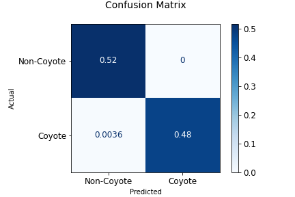
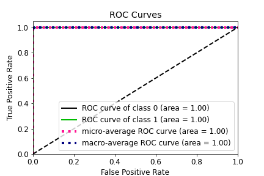

## Coyote Project

# Team Coyote2 : Deep Learning

## Contents
1. [Team](#team)
2. [Overview](#overview) 
3. [Research problem statements](#research-problem-statements)
4. [Research novelty](#research-novelty)
5. [Requirements](#requirements)
6. [Technology Stack](#technology-stack)
7. [Deep Learning](#deep-learning)
    - [dataset](#dataset)
    - [Model & Hyper Parameters](#model-&-hyper-parameters)
    - [Experiment](#experiment)
    - [Result](#result)    

# Team

| Name         | University               | Department                                   | Email               | Contact                        |
| :------------- | :------------------------: | :--------------------------------------------: | :-------------------: | :------------------------------: |
| Yejin Lee    | Hallym University        | Dept. of Computer Science                    | leeye0616@naver.com | https://github.com/yetniek     |
| Heesun Jung  | Hallym University        | Dept. of Computer Science                    | glee623@naver.com   | https://github.com/glee623     |
| Youngbin Kim | Kwangwoon University     | Dept. of Computer Information                | binny9904@naver.com | https://github.com/0binn       |
| BoKyung Kwon | Kwangwoon University     | Dept. of Computer Information                | bbo1209@naver.com   | https://github.com/doomdabo    |
| Jihyun Park  | Jeju National University | Dept. of Computer Science & Statistics       | mmmszip@gmail.com   | https://github.com/mmmtobezip  |
| Griffin Pegg | Purdue University        | Dept. of Computer and Information Technology | pegge@purdue.edu    | https://github.com/coyotehowls |


# Overview 


# Research problem statements 

The attacks on livestock, human, and crops by coyotes are occurring over the United States, while traditional simple management such as public education about the method of avoiding coyotes and coyote hunting contests to reduce their numbers are executed. There are not sufficient cases of technical approaches or research about the damage to coyotes. 


# Research novelty 

The method of coyote howling sound classification using Convolutional Neural Network (CNN) to reduce the damage of coyotes is needed. This paper suggests using a network connection in order to prevent the damage by informing the neighborhood farms when coyotes appear and chasing coyotes through a coyote alert system. It is expected that additional technical approach to current coyote damage prevention can improve the accuracy and make the previous management more practical.


# Requirements
### version
`Python 3.7 ~ 3.9`

`Colab` 

`Librosa`

### Configuration

```python
conda install -c conda-forge pyngrok  
```

### file structure
C:.  
│  base_line.ipynb  
│  make_mel_s.ipynb  
│  move_wav_file.ipynb  
│  train.csv  
│  valid.csv  
│  
├─dataset  
│  ├─train  
│  └─valid   
├─dataset_all  
└─mel_spectrogram
    ├─train_mel    
    └─valid_mel  
 

# Technology Stack

# 


# Deep Learning
## Dataset
There are a total of 1,160 training dataset. It consisted of 586 coyotes, 480 dogs, and 94 chickens. And the test data set is a total of 280 sheets. It consisted of 134 coyotes, 117 dogs, and 29 chickens.
Training data and test data were divided in a total ratio of 8:2.

## Model & Hyper Parameter

The experimental setting is as follows: 

- Optimization function : Adam optimizer
- Learning rate : 0.001, the 
- Batch size : 10, and the
- Epoch : 100. 
- Sampling rate : 16,000 (MFCC)

## Experiment


<p align="center">


<p align="center">

The loss value of the evaluation set : 0.0324

the accuracy was 279 out of 280
